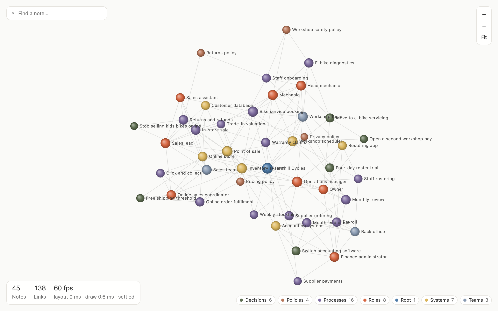
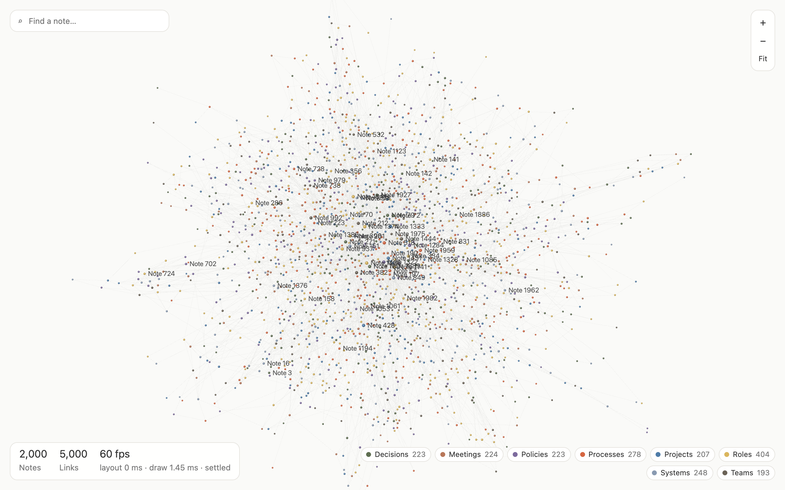

# Markdown knowledge graph

Render a knowledge graph from a folder of Obsidian-style markdown notes. Every note is a node, every `[[wikilink]]` between two notes is an edge, and notes are coloured by their top-level folder.

It is a small, readable reference implementation: about 120 lines to turn markdown into a graph, and about 550 lines of React and canvas to draw it. It is not a library and has no plugin system. Copy the parts you need.



The sample above is `examples/sample-vault`: 45 fictional notes about a made-up bike shop (roles, teams, processes, systems, decisions, policies).

## Quick start

Needs Node 22 or later.

```sh
npm install
npm run dev
```

Open the URL Vite prints (usually http://localhost:5173). The repo ships a `public/graph.json` built from the sample vault, so it renders straight away.

To draw your own notes:

```sh
npm run graph -- ~/MyVault
npm run dev
```

`npm run graph` walks the folder, skips hidden folders (`.obsidian`, `.git`, `.trash`) and `node_modules`, and overwrites `public/graph.json`. It prints how many notes, links and unresolved wikilinks it found. Add `--no-excerpts` to leave out the text preview for each note (smaller file for big vaults), or `--out path.json` to write somewhere else.

In the app: drag the background to pan, scroll to zoom, drag a node to move it, click a node to open its panel (excerpt and linked notes), type in the search box to highlight matches, and click a folder in the legend to hide or show it.

Other commands:

| Command | What it does |
|---|---|
| `npm test` | Unit tests for the parser and graph builder (Vitest) |
| `npm run build` | Type-check and build to `dist/` |
| `npm run generate:large` | Write synthetic graphs of 500, 2,000 and 5,000 nodes to `public/` (any sizes: `npm run generate:large -- 1000 10000`) |
| `npm run bench:layout` | Time the layout alone in Node, no drawing |

Open a synthetic graph with `http://localhost:5173/?graph=large-2000.json`.

## How it works

```
markdown files  ->  wikilink parser  ->  graph.json  ->  d3-force layout  ->  canvas
(your vault)       src/graph/           public/          in the browser       2D context
                   buildGraph.ts
```

1. **Parse** (`src/graph/buildGraph.ts`, pure function, no file system). For each `.md` file:
   - id is the path without `.md`, e.g. `Processes/Payroll`
   - label is frontmatter `title`, else the first `# ` heading, else the file name
   - group is the top-level folder (`Root` for notes at the top of the vault)
   - links are every `[[target]]`, `[[target|alias]]`, `[[target#heading]]` or `[[Folder/target]]`, ignoring anything inside code blocks
2. **Resolve.** A link target matches a note by exact path first, then by file name, then by file name ignoring case. That is close to Obsidian's default. If two notes share a file name, the alphabetically first path wins, so the result does not depend on read order. Links that match nothing are counted and dropped.
3. **De-duplicate.** Edges are undirected: A links to B and B links to A is one edge. Self-links are dropped.
4. **Size.** Node size is `1.5 + 0.9 × √degree`, so hubs stand out without swallowing the map.
5. **Write** `public/graph.json` (`scripts/build-graph.mjs`). The browser never reads markdown; it only loads this file.
6. **Lay out** (`src/graph/GraphCanvas.tsx`). A d3-force simulation with four forces: link springs, many-body repulsion (Barnes-Hut), collision so nodes do not overlap, and centring. The simulation is stepped by hand, one tick per animation frame, until it cools (227 ticks with the settings here), then stops.
7. **Draw.** Every frame clears the canvas and redraws all links (batched into one path) and all nodes (radial gradient spheres, cached by colour and size). Labels are drawn only for the best-connected nodes, plus whatever is hovered, selected or matches the search.

## The tech stack

- **TypeScript** throughout, including the graph builder the CLI uses (run with `tsx`).
- **React** for the panels around the map: search, legend, stats, side panel. React does not draw the graph and does not re-render on each frame; the draw loop reads UI state from a ref.
- **d3-force** for the layout. It is small, well understood and has no rendering opinions.
- **HTML canvas 2D** for drawing, scaled by `devicePixelRatio` so it is sharp on high-DPI screens, redrawn with `requestAnimationFrame`.
- **Vite** for the dev server and build. **Vitest** for tests.

Runtime dependencies are `react`, `react-dom` and `d3-force`. Nothing else.

**Why canvas and not SVG or DOM elements?** With SVG, every node, link and label is a DOM element. At a few hundred nodes that is fine and you get CSS, events and accessibility for free. At a few thousand, the browser spends its time on style, layout and paint for thousands of elements every time the simulation moves them, and that is usually the first wall people hit. Canvas is one element: you issue draw calls and the browser keeps no per-item state. The cost is that you do your own hit-testing (here a linear scan on mouse move), your own pan and zoom, and you lose built-in accessibility. Canvas 2D is still CPU-side work per item each frame, so it has its own wall, just further out. WebGL moves it further again (see below).

## Where it slows down, and what to do

Be clear about what this is: an approach that is comfortable at hundreds of nodes and fine into the low thousands on a decent laptop. Two separate costs grow with the graph:

- **Layout** (d3-force), on the main thread. Each tick is roughly O(n log n) for repulsion plus O(edges) for springs. While it runs it competes with drawing and input for the same thread.
- **Drawing** (canvas 2D). Every frame redraws every link and node. This is cheaper than the layout here but grows linearly.

### Measured numbers

Measured on 7 October 2026 on an Apple M1 Pro (2021 MacBook Pro), headless Google Chrome 154 with GPU acceleration (Metal), 1280 to 1440 px wide window at device pixel ratio 2. The app's own counters (`window.__graphPerf`) report frames per second and the mean time per frame spent ticking the layout and issuing draw calls. Graphs from `npm run generate:large` (2.5 links per note, clustered, a few hubs).

| Nodes | Links | Layout ms per tick | Draw ms per frame | FPS while layout runs | FPS once settled | Time to settle |
|---:|---:|---:|---:|---:|---:|---:|
| 45 (sample) | 138 | 0.3 | 0.4 | 60 | 60 | 3.8 s |
| 500 | 1,250 | 2.4 | 0.6 | 60 | 60 | 3.8 s |
| 2,000 | 5,000 | 9.3 | 1.5 | 60 | 60 | 3.8 s |
| 5,000 | 12,500 | 25.4 | 3.7 | 33 | 60 | 7.0 s |
| 10,000 | 25,000 | 58.1 | 7.4 | 15 | 60 | 15.7 s |

The layout alone in Node (`npm run bench:layout`, same machine, no drawing): 1.9 ms per tick at 500 nodes, 10.1 ms at 2,000, 29.1 ms at 5,000, 70.7 ms at 10,000.

How to read this:

- A frame has about 16.7 ms at 60 fps. Up to about 2,000 nodes, a layout tick plus a draw fits inside that on this machine. Somewhere between 2,000 and 5,000 the layout tick alone uses the whole budget, and the frame rate halves while the graph is settling. Dragging a node reheats the simulation, so the same slowdown comes back every time someone drags.
- Once the layout has cooled, drawing 10,000 nodes still holds 60 fps here. The steady-state draw is not the first problem; the layout is.
- An M1 Pro is a fast machine. On a typical office laptop expect the layout to be two to three times slower, which moves the wall down to the 1,000 to 2,000 node range.
- **Without GPU acceleration it is much worse.** The same test in headless Chromium using software rendering (SwiftShader, no GPU) dropped to 17 fps at 500 nodes and 2 fps at 2,000 while the layout was running, because rasterising a high-DPI canvas on the CPU dominated every frame. Virtual desktops, remote sessions and some locked-down corporate machines run browsers this way. If your graph is slow at around 1,000 nodes, check `chrome://gpu` first.
- Above a few thousand nodes the picture stops being readable anyway. The 2,000-node graph below draws at 60 fps but is a hairball; no renderer fixes that.



Reproduce:

```sh
npm run generate:large -- 500 2000 5000 10000
npm run bench:layout -- public/large-500.json public/large-2000.json public/large-5000.json public/large-10000.json
npm run dev
# open /?graph=large-5000.json and watch the counter bottom left
```

### What to do about it, roughly in order of effort

1. **Stop the simulation after it cools.** This repo already does (ticking ends once alpha drops below its minimum). Lowering `alphaDecay` gives a better layout but more ticks; raising it settles sooner. Also consider redrawing only when something changes rather than every frame.
2. **Level-of-detail labels.** Text is the most expensive thing per item on a canvas. Only label the top nodes, and show more as the user zooms in. This repo labels the best-connected 4% (15 to 60 notes) plus whatever is hovered, selected or searched.
3. **Run d3-force in a Web Worker.** Post node and link arrays in, post positions back (ideally as a `Float32Array`, transferred rather than copied) each tick. The page stays responsive while the layout runs. The layout does not get faster, but drawing and input stop waiting for it.
4. **Precompute the layout offline.** Run the simulation in Node at build time (the same code as `scripts/bench-layout.mjs`), write `x` and `y` into `graph.json`, and have the browser render positions only. Load time becomes draw time. Keep a short warm simulation only for dragging. For a graph that changes daily, this is usually the biggest single win.
5. **Use a spatial index for hit-testing.** Hover here is a linear scan over every node on each mouse move. `d3-quadtree` makes it logarithmic.
6. **Cluster or aggregate.** Show folders, or detected communities, as single nodes and expand on click. [graphology](https://graphology.github.io/) with `graphology-communities-louvain` finds communities in tens of thousands of nodes in well under a second. This also fixes readability, which no renderer does.
7. **Switch to a WebGL renderer for 10,000 nodes and up.** [sigma.js](https://www.sigmajs.org/) (built on graphology, with ForceAtlas2 in a worker) handles tens of thousands of nodes. [cosmos / Cosmograph](https://cosmograph.app/) runs the force layout itself on the GPU and handles hundreds of thousands. You give up some drawing freedom (gradients, custom shapes) in exchange.

## Project layout

```
src/graph/types.ts          Graph, node and link types
src/graph/buildGraph.ts     Markdown -> graph (pure, tested)
src/graph/buildGraph.test.ts
src/graph/GraphCanvas.tsx   The canvas renderer
src/App.tsx                 Loads public/graph.json (or ?graph=<file>)
scripts/build-graph.mjs     CLI: vault folder -> public/graph.json
scripts/generate-large.mjs  Synthetic graphs for load testing
scripts/bench-layout.mjs    Layout timing without drawing
examples/sample-vault/      45 fictional notes
```

## Limits worth knowing

- Frontmatter is read for `title` only, with a simple line reader rather than a full YAML parser.
- Only `[[wikilinks]]` count as links. Standard markdown links (`[text](note.md)`), tags and frontmatter references are ignored. Adding them is a change to `wikilinks()` in `buildGraph.ts`.
- Grouping is by top-level folder only.
- The canvas has no keyboard navigation or screen reader support. The side panel and legend are ordinary buttons.

## Licence

MIT. See [LICENSE](LICENSE).

Made by James Oldham, Sentry AI (sentrysolutions.ai).
